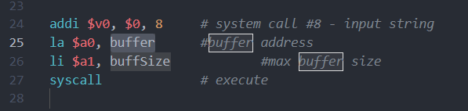

# MIPS lauguage support README

This VSCode extension provides basic MIPS colorization and snippets support.

based on the MIPS language support extension by [kdarkhan](https://github.com/kdarkhan/vscode-mips-support/blob/master/)

## Features

based on the MIPS language support extension

Changed to a more compact code format

added colorization to .macro and .end_macro

added snippets for macro

add store value for inputxxx snippets

## Requirements

just install it

## Release Notes

### 0.0.1

initial release
